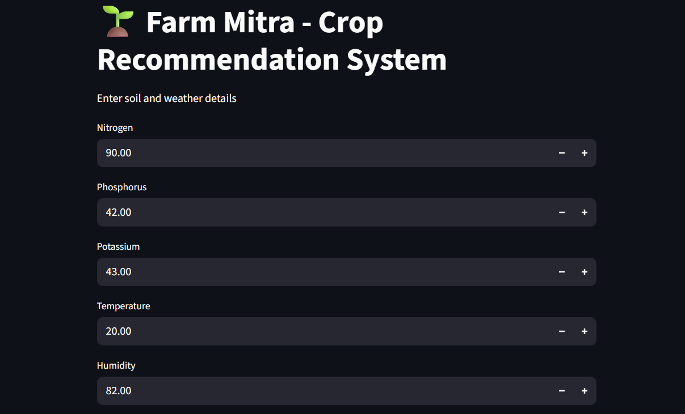
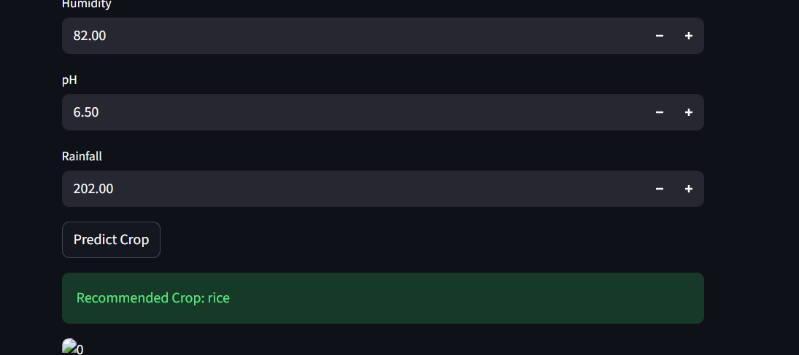

# Crop Recommendation System

Machine Learning based system that suggests the best crop based on soil and environmental conditions.

## Tech Stack
- Python
- Pandas
- Scikit-learn
- Streamlit

## Features
- Predicts suitable crop
- Uses trained ML model
- Simple UI with Streamlit

## How to Run

1. Clone the repository
2. Install dependencies:
   pip install -r requirements.txt
3. Run the app:
   streamlit run app.py

## Output

## Files
- app.py → main application
- model.pkl → trained model
- dataset → training data

